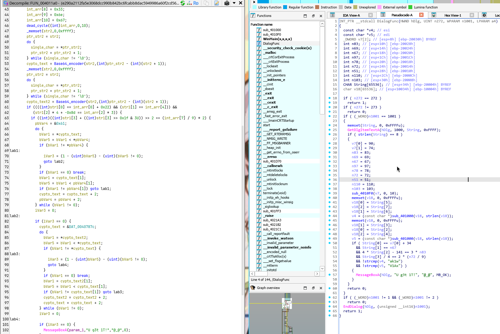
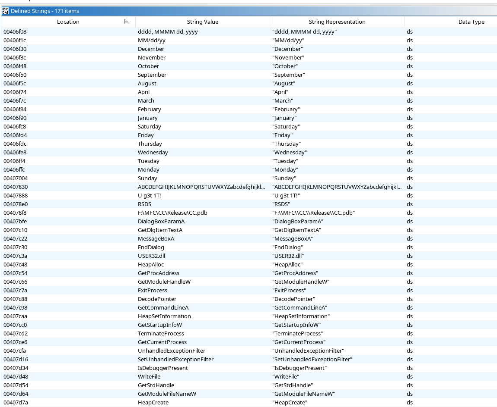
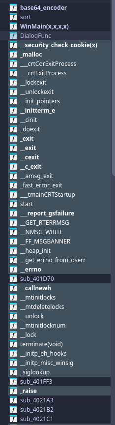
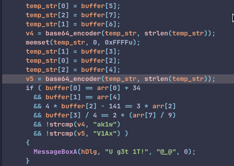
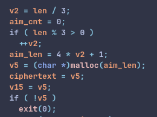
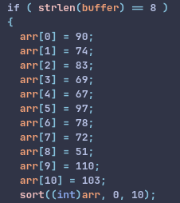
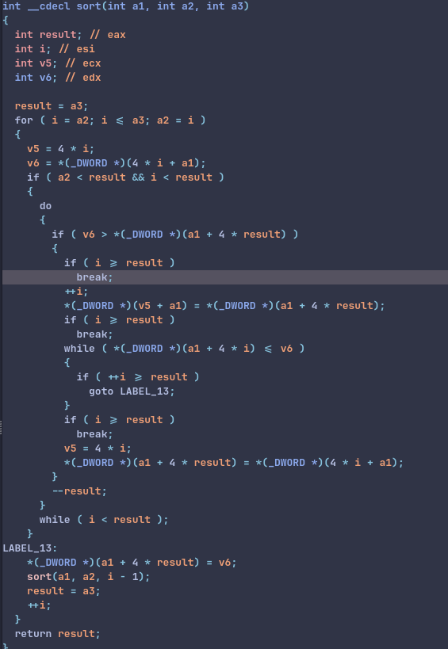
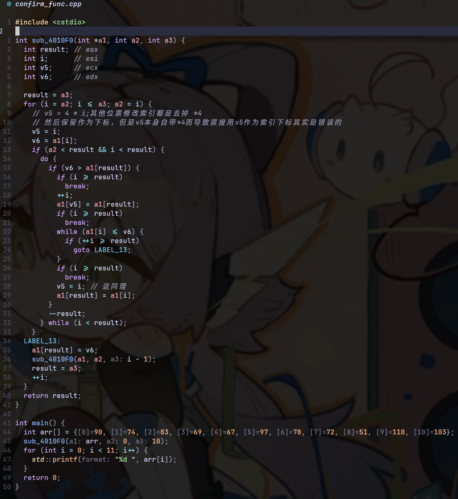

# 解题笔记

## 工具差异

不得不说，我之前对于工具能力的差异的理解还长期停留在对于函数的理解和对类型的判断，直到无法理解这个题目的反汇编代码后，尝试去查题解，我才注意到原来自己看见的内容和别人眼中的差异之大：  
  
就，挺难绷的，当时看着左边`ghidra`的代码看了半天，怎么翻译都是死代码，结果到最后看了题解的图片，发现”你的附件反汇编在这里可是完全不一样哦“  
于是，我终于还是决定去寻觅一个能用的`ida pro`了

### IDA Pro for linux

嗯。。这个那个，这种东西小范围享受一下就可以了，所以也就小小的在一个小板块讲一下就好，完整写一个如何用破解IDA我也怕被追杀  
[浅浅放一个我翻到的资源来源，这年头还能找到个同道，用Arch Linux的IDA真的很罕见](https://bbs.kanxue.com/thread-290063.htm)  
其实这些破解我看思路都差不太多，主要还是之前我找到的自己都没法用(现在发现问题所在我估计是同样的，但是我没兴趣去检测了)  
总之就是用官方的安装包，安装一个完全正版的软件文件，然后用**keygen3.py**的代码伪造`idalib.so`和证书，替换掉就行  
本来到这里就完事了，但是我发现无论自己怎么弄，一旦尝试逆向，就会看见一个75什么的报错，下面输出写的找不到对应的**文件加载器模块**比如:`pe.so`，可是本地是能看见相应文件的  
最后发现似乎是工作区对于文件索引方式是用的相对地址比如`./loaders/pe.so`，但是我是直接用`/ida`启动的，导致似乎后面导入文件的时候会出现问题，因为似乎路径被改过去了，导致用相对地址搜索文件加载器模块是搜索不到的  
最后发现用**绝对地址**(比如我的就是/opt/ida-pro/ida)启动文件就可以解决，具体原因暂时不明

## 翻找关键信息

这个我在用ghidra的时候感觉还是比较艰难的，因为ghidra的GUI基本就是一坨，搜索也比较难绷，所以如何找到切入点是一个问题  
直接搜索字符发现什么`flag`、`printf`之类的东西都没有，最后在密密麻麻的一片可见字符串(所以说ghidra的GUI是一坨,尤其是在我的 niri上显示得更不舒服)里面找到了一个奇特的`U g3t 1T!`，这显然是`you get it!`的低客表示方式,差不能猜到这就是flag藏身点了  
于是我们就去找交叉引用，找到了`DialogFunc`  
  
当然，换到了IDA Pro后(个人喜好原因还换了个mocha皮肤看上去清爽很多)，一切就清晰起来了，左边一栏可以直观地看到各个函数，而且底色还能清晰看出来哪些是系统函数，可以不看，这种情况下可以直接暴力找到关键函数(部分被我解题时重命名过)  


## 加密函数

接下来就是正式的解读环节了，顺序解读其实不算是一个比较明智的解题思路，甚至有时会被莫名其妙的废代码浪费时间，我们这里选择从刚刚找到的核心字符串入手，从那个位置开始往上面看：  
  
我们可以看见这里有一个比较直白的对比`v5`和一个字符串,`v4`和另一个字符串，而且两者的赋值都是调用了同一个函数，所以我们看看这个函数究竟是做什么用的:  
  
我们可以看见这个部分有一个除三乘四还有补余长度，有一种三转四的强烈既视感，然后我们还在下面的一个全局数组，去data段看见了这样的一串:  
  
基本可以猜到这就是一个base64加密函数(命名是我后面改的),而如果真的去阅读一次也确实是base64加密，当然，如果追求速度，可以大胆假设
然后这边贴一个自己手写的rust base64解码代码作为练习:

```rust
fn main() {
    let mut input = String::new();
    std::io::stdin().read_line(&mut input).unwrap();

    let s = "ABCDEFGHIJKLMNOPQRSTUVWXYZabcdefghijklmnopqrstuvwxyz0123456789+/=";
    let s_bytes = s.as_bytes();
    let mut debase64_table = vec![0; 256];
    for i in 0..s.len() {
        debase64_table[s_bytes[i] as usize] = i;
    }
    let bytes = input.into_bytes();
    let len = bytes.len() - 1;
    let mut i = 0;
    let mut cnt = 0;
    let mut output = vec![0; len];
    while i < len {
        let mut temp: u32 = 0;
        for _ in 0..4 {
            temp = (temp << 6) | (debase64_table[bytes[i] as usize] as u32 & 0x3f);
            i += 1;
        }
        for j in 0..3 {
            output[cnt] = ((temp >> (8 * (2 - j))) & 0xff) as u8;
            cnt += 1;
        }
    }
    if let Ok(s) = String::from_utf8(output) {
        println!("decode: {}", s);
    }
}
```

## 排序函数

然后我们尝试解码这两个小段落，解出一部分字符，但是在和下面其他几个判断进行验算的时候发现对不上，那么显然其实我们看见的这个数组其实应该是被改动过了，于是我们继续看看:  
  
可以看见我们的这个数组在赋值后被传入了一个函数中(名字依旧是后面命名的)，这里有一个点，如果看见了一串的赋值然后接着一个函数，很有可能是用来排序的，至于是升序还是降序就不清楚了  
所以我们依旧是进入函数查看:  
  
可以看见这里有一个比较琐碎的函数，甚至有一个递归(这里必须抨击一下ghidra的反编译，我当时看见到是一个无限循环的递归调用以及一片根本不会进入到的if语句，当时直接判断为死循环了)  
所以如果想要直接解读代码，就比较费力了

### 探索函数功效小技巧

因此这里有一个理解函数功效的小技巧,对于一个麻烦的函数，可以直接选择跑起来看看结果，直接获取其功效而不管实现  
所以我们这里只需要大概把这个东西给改为一个能被C或者Cpp直接运行的函数然后把输入给它就好
而在这里我们可以看见唯一的那些不能被直接运行的就是`*(* DWORD)`了，而我们需要知道DWORD其实就是一个32位的类系，所以其实这就是一个int32的指针强制转，而结合后面的`a1 + 4*i`之类的东西，基本可以确定其实这就是`a1[i]`的意思，我们只需要把这个东西修改一下就行  
但是这里有一个需要注意的点，`v5`是在赋值的时候就被乘以4的，而在int32类型的`[]`运算过程中，一个单位就是4字节，所以如果粗暴地写为`a1[v5]`就会导致索引完全就是偏的，结果和事实完全不同  
所以我们这里需要把v5的两处乘4都去掉  
然后再看我们的输入，是把`v7`(在这里被我命名为了`arr`)给传入作为了第一个参数，从逻辑上看显然是传入了一个int32的指针，而且显然长度远远不只两个(因为原来IDA的代码中其实只有v7[0]和v7[1]，后面是v8v9……)，显然是被错误地解读了数组的长度，我们需要手动修改一下，然后就可以放在自己的Cpp文件里面了:  
  
运行的结果也确实是一个排序，升序排序，这下我们只要把正确的顺序给带入计算，就能拼接出那个长度为8(写在if的开头)的字符串了

## Windows API

然而事实上，对于这个字符串就是flag的一事最初完全是我的假设，我根本没弄明白为啥这样是目标flag，只不过是根据经验的假设  
而事实上，这里有个比较常识性质的知识，那些被IDA解读出来的，明显有名称的、但是无法被直接索引到的、色彩不一样的函数并不是缺失了  
因为我当初尝试看代码的时候发现无法交叉引用，一度以为是数据缺失  
然后才知道这些都是Windows 的API，因为并不是自带的核心库，自然不会被直接写出来  
这里我们简单整理几个常见的:  
| 函数名称 | 函数签名 | 函数功能 |
| :--- | :--- | :--- |
| `GetDlgItemTextA` | `UINT GetDlgItemTextA(HWND hDlg, int nIDDlgItem, LPSTR lpString, int cchMax);` | 从对话框中的控件（如编辑框）读取文本，存入缓冲区。 |
| `MessageBoxA` | `int MessageBoxA(HWND hWnd, LPCSTR lpText, LPCSTR lpCaption, UINT uType);` | 创建一个模态对话框，显示消息和按钮，返回用户点击的按钮ID。 |
| `EndDialog` | `BOOL EndDialog(HWND hDlg, INT_PTR nResult);` | 销毁一个模态对话框，并返回 nResult 给创建对话框的 `DialogBox` 调用。 |
| `FindWindowA` | `HWND FindWindowA(LPCSTR lpClassName, LPCSTR lpWindowName);` | 根据类名或窗口名查找顶层窗口，返回窗口句柄。 |
| `SendMessageA` | `LRESULT SendMessageA(HWND hWnd, UINT Msg, WPARAM wParam, LPARAM lParam);` | 向指定窗口发送消息，等待窗口处理完成并返回结果。 |
| `PostMessageA` | `BOOL PostMessageA(HWND hWnd, UINT Msg, WPARAM wParam, LPARAM lParam);` | 将消息放入指定窗口的消息队列后立即返回（不等待处理）。 |
| `GetDlgItem` | `HWND GetDlgItem(HWND hDlg, int nIDDlgItem);` | 获取对话框中指定控件的句柄。 |
| `DestroyWindow` | `BOOL DestroyWindow(HWND hWnd);` | 销毁指定窗口及其所有子窗口，并发送 `WM_DESTROY` 消息。 |
| `IsWindow` | `BOOL IsWindow(HWND hWnd);` | 判断给定的句柄是否是一个有效的窗口句柄。 |

在IDA中，`HWND` 是Windows操作系统中一个非常重要的数据类型，全称是 Handle to a Window(窗口句柄)  
简单理解为用来明确指代的到底是哪一个窗口的识别码就行
其他有一些没见过的数据类型有一个相似的`lp`前缀，其实在 Windows API 中，lp 是 Long Pointer（长指针）的缩写，可以选择跳过来看类型比如`lpText`就理解为`Text`

所以这样看就可以理解为什么我们连`printf`都搜索不到了，这个程序是通过Windows的窗口调用来实现输入输出的
